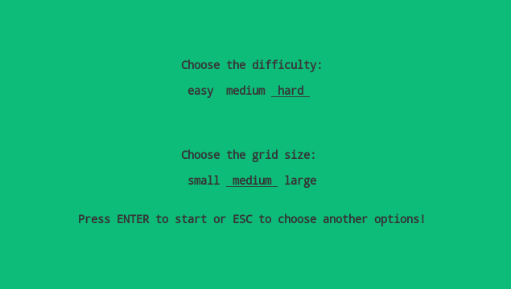
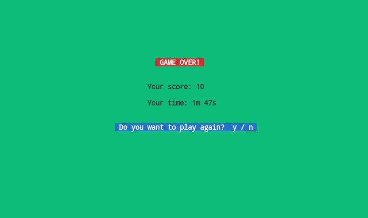

# Console Snake Game


## Overview

The Console Snake Game is a classic snake game implemented entirely in the console, providing a fun and nostalgic gaming experience. It features ASCII-based graphics, sound effects, and background music using SDL (Simple DirectMedia Layer) to enhance gameplay. You can run it from anywhere in your terminal, making it easily accessible.

## Features

- Classic Snake Gameplay: Navigate the snake through the game board, eat food, and grow while avoiding collisions with walls and yourself.

- ASCII Art Graphics: Enjoy a visually appealing 2D game with ASCII characters, creating a retro-style atmosphere.

- Sound Effects: Experience immersive gameplay with sound effects for snake movement, eating food, and collisions.

- Background Music: Listen to background music while playing to enhance the gaming experience.

- User-Friendly Interface: The game provides a user-friendly interface with clear instructions and controls.
   - Start screen:
   
   - End Screen:
   

- Easy to Run: You can run the game from any directory in your terminal, thanks to its flexible file loading system.

## How to Play

1. **Controls**:
   - Use the arrow keys (up, down, left, right) to control the snake's direction.
   - Press the `ESC` key to quit the game at any time.

2. **Game Objective**:
   - Eat the food to grow the snake.
   - Avoid collisions with the snake's own body.
   - Try to achieve the highest score possible.

3. **Scoring**:
   - Your score increases with each food item eaten.
   - The game keeps track of your highest score.


## Dependencies

To run the Console Snake Game, you'll need the following dependencies:

- SDL2 (Simple DirectMedia Layer): Required for sound effects and background music.
- SDL2 Mixer: Required for enhanced audio capabilities.
- pthreads: Required for multithreading support.

Make sure to install these dependencies on your system before running the game.

## Running the Game

1. **Build the Game**:

   To build the Console Snake Game, follow these steps:

   1. Open your terminal.

   1. Navigate to the directory containing the game files.

   1. Generate the build files using CMake:

      ```bash
      cmake .
      ```

   1. Build the game using `make`:

      ```bash
      make
      ```

2. **Run the Game**:

   Once the game is successfully built, you can run it with the following command:

   ```bash
   ./main


## Disclaimer

This Console Snake Game project is created purely for fun, educational purposes, and as a creative exploration. You are encouraged to use, modify, and distribute this code for your own learning and enjoyment. Feel free to adapt it, add new features. Your creativity and ideas are welcome.

Happy coding and gaming!
